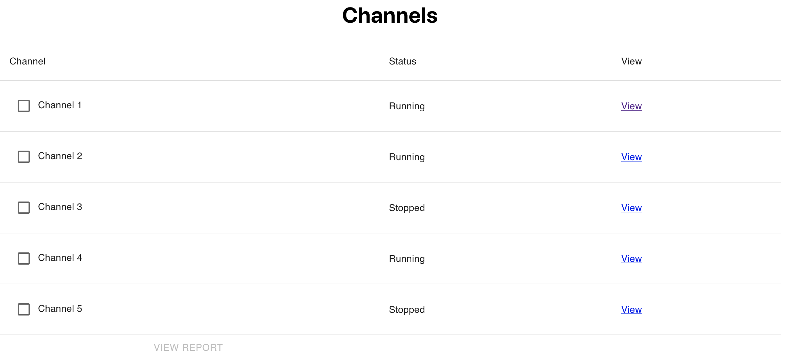
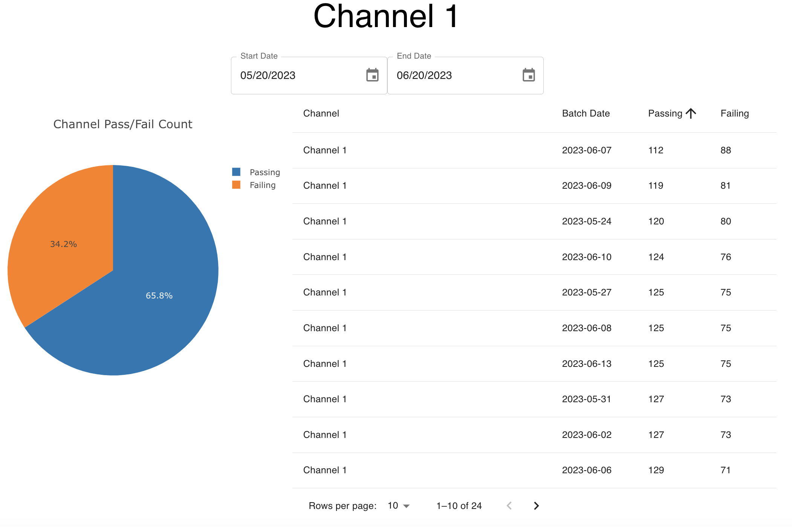

# Frontend take home 01

A take home exercise for candidates for frontend engineering

Please spend no more than four hours on this project. If you get stuck feel free to contact us with
your questions, we work as a team and would be happy to support you during this project.

The app is put together using Create React App. You can start the application the first time by running:
``npm i && npm start`
Following that you can simply run `npm start`

API endpoints are mocked using Mock Service Worker. Endpoints are setup at:

- `/api/batches`
- `/api/channels`
- `/api/channel_report`

You can call to the API using any method of your choosing. For example,
using fetch you could call:

```javascript
const response = await fetch("/api/batches");
const jsonResponse = await response.json();
```

The Responses for these APIs are:

`/api/channels`

```json
[
  {
    "name": "Channel 1",
    "id": "bb20a4f7-b755-487d-966c-404d2cf3cd23",
    "status": "running"
  },
  {
    "name": "Channel 2",
    "id": "c2781177-995b-4013-9ade-b6f8d53e7bf1",
    "status": "running"
  }
]
```

`/api/batches`

```json
[
  {
    "date": "2023-05-21",
    "channel": "bb20a4f7-b755-487d-966c-404d2cf3cd23",
    "passing": 136,
    "failing": 64
  },
  {
    "date": "2023-05-22",
    "channel": "bb20a4f7-b755-487d-966c-404d2cf3cd23",
    "passing": 137,
    "failing": 63
  }
]
```

`/api/channel_report/`

```json
{
  "startDate": "2023-05-20T07:00:00.000Z",
  "endDate": "2023-06-20T07:00:00.000Z",
  "total": 4800,
  "passing": 3159,
  "failing": 1641,
  "byChannel": [
    {
      "channel": "bb20a4f7-b755-487d-966c-404d2cf3cd23",
      "passing": 3159,
      "failing": 1641
    }
  ]
}
```

The `channel_report` and `batches` endpoints accept query parameters for the start/end date
and the channels of interest. For example to filter results to channels `CH1` and `CH2` between
`6/1/22` and `6/1/23` the following query string could be used:
`startDate=2022-06-01&endDate=2023-06-01&channelId=CH1&channelId=CH2`

# Evaluation guidelines

Evaluation is primarily on the functional requirements being met.
Styling beyond the screenshots provided is welcomed, but is not required (you should understand
the design provided as a wireframe of the final product).
Please look for opportunities to use re-usable logic and components.

_You may add any and all packages you would like and are encouraged to use component
libraries and data fetching libraries to aid you_

# Requirements

## Story

As a battery executive I would like to see the status of my production channels and be
able to see reports on quality control metrics (pass/fail) for particular batches and channels.
A "batch" is the output of a particular channel on a particular day.

## Detailed requirements

- Application landing page should be a table of channels with their name, status, and a link to view
  a detail report on them. The table rows should be selectable so that the user can select multiple channels
  and view a report across multiple channels. A rough design of this:
  

  - The "View" Button of each row should take the user to the detail view of that channel (details to follow)
  - The "View Report" button should only be activated if the user has selected 1 or more channels, via
    their checkbox. When the "View Report" button is clicked the user should be taken to a bulk report
    view for the selected channels

- The Bulk Report and Detail Views should be more or less identical, the only change
  being the channels that are represented in the view. A rough design of the detail view:
  

  The View has 3 parts, a date range picker, a pie chart, and a table:

  - The pie chart should show the pass/fail comparison count for the channel(s) and date range
  - The table should show the pass/fail comparison count at the batch level for the channel(s) and date range
    - The table should be sortable (ascending and descending) for the date, passing, and failing
    - The table should use basic pagination so that the user can see sub sets of the data.
  - The date picker should have two selections, one for start date and one for end date. The chart/table should
    source their data using this date range and should update when the user updates the selected dates.

- When doing a Bulk Report the page header should say "Bulk Report" when doing a detail view of a channel,
  the channel's name should be shown (as is in the screenshot)

- Bulk and Detail views should support permalinks, meaning that the linked can be shared and returned to
  by another person or at a later date to see the same data.
  - The link _does not need_ to persist the date range or the sorting/pagination of the table, it only
    needs to persist the channels of interest
